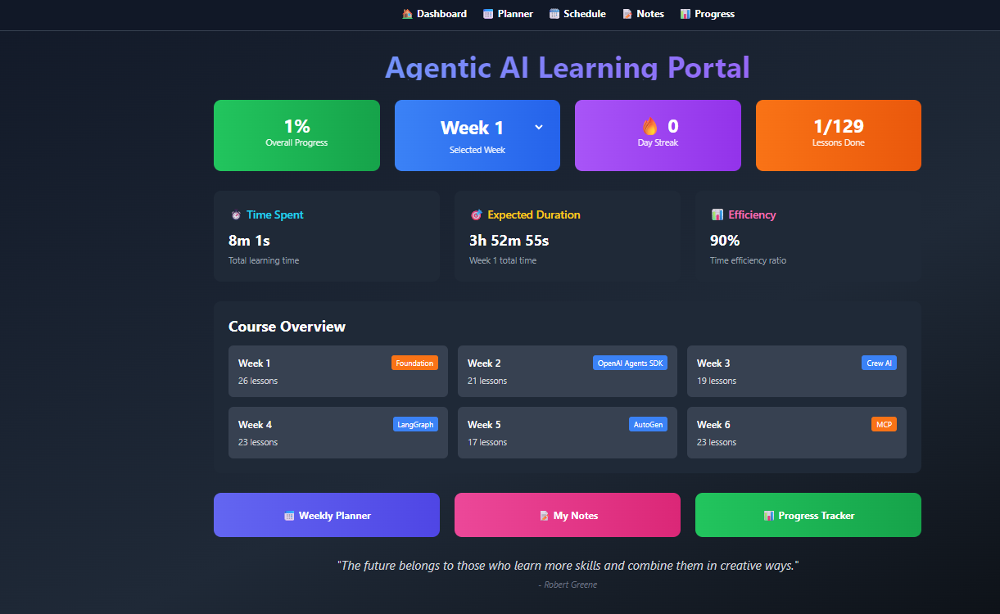
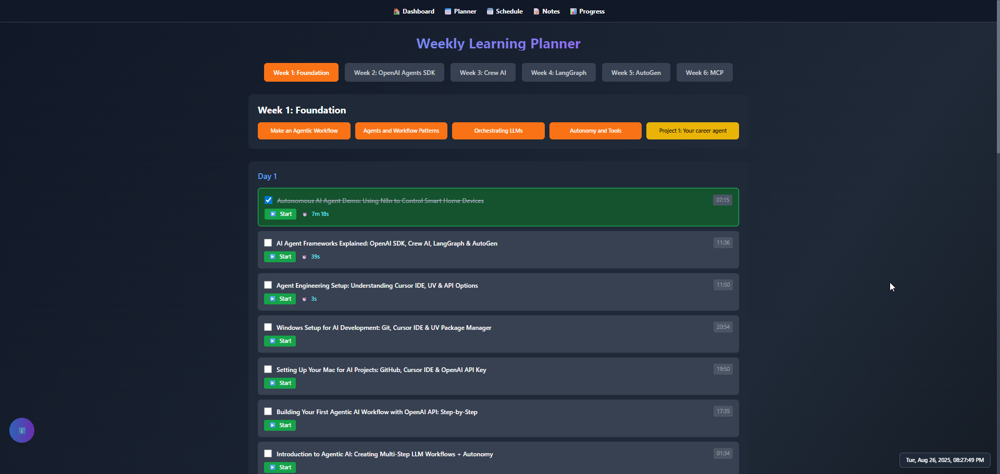
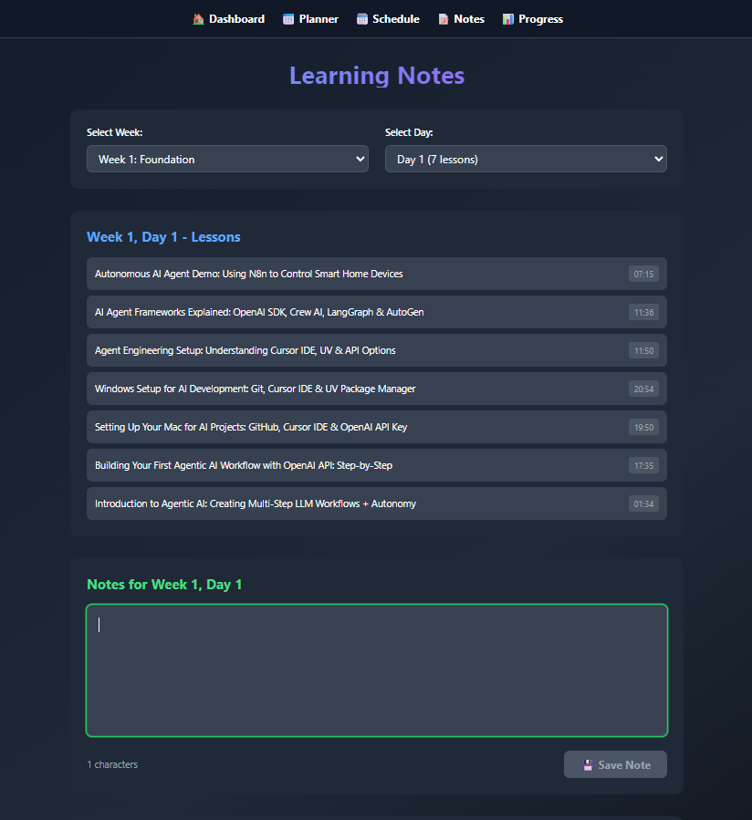
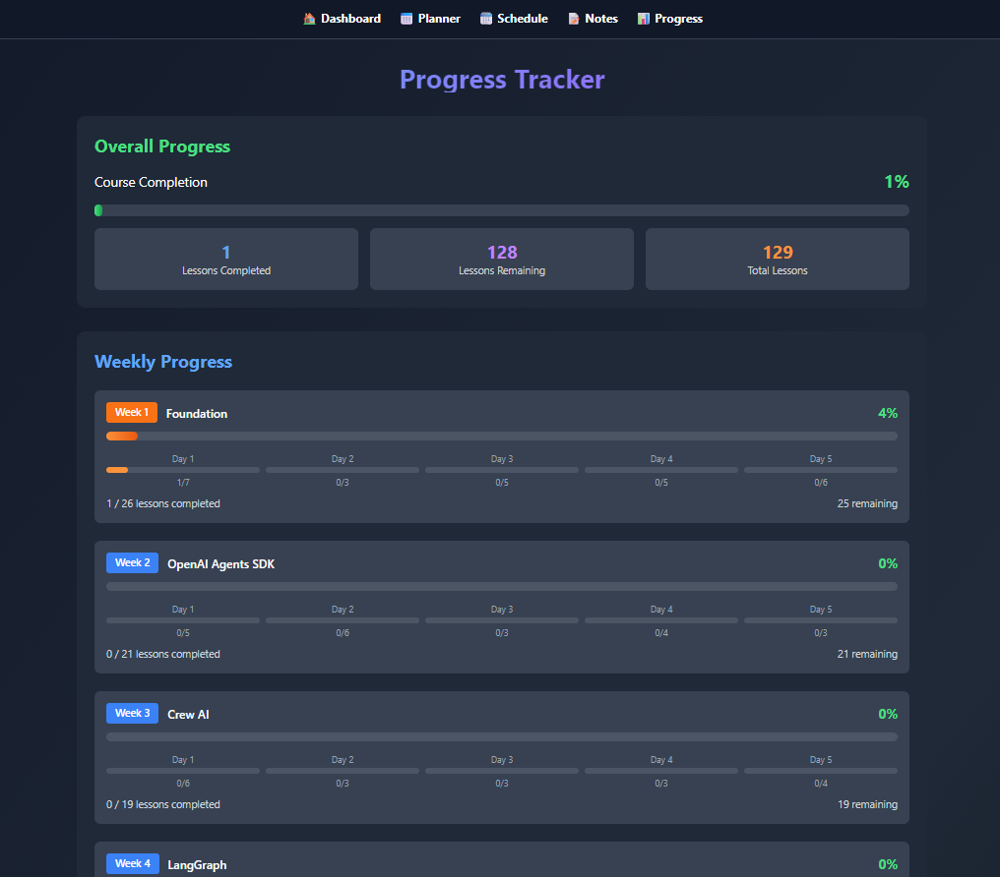
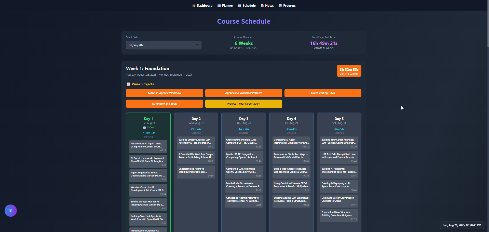
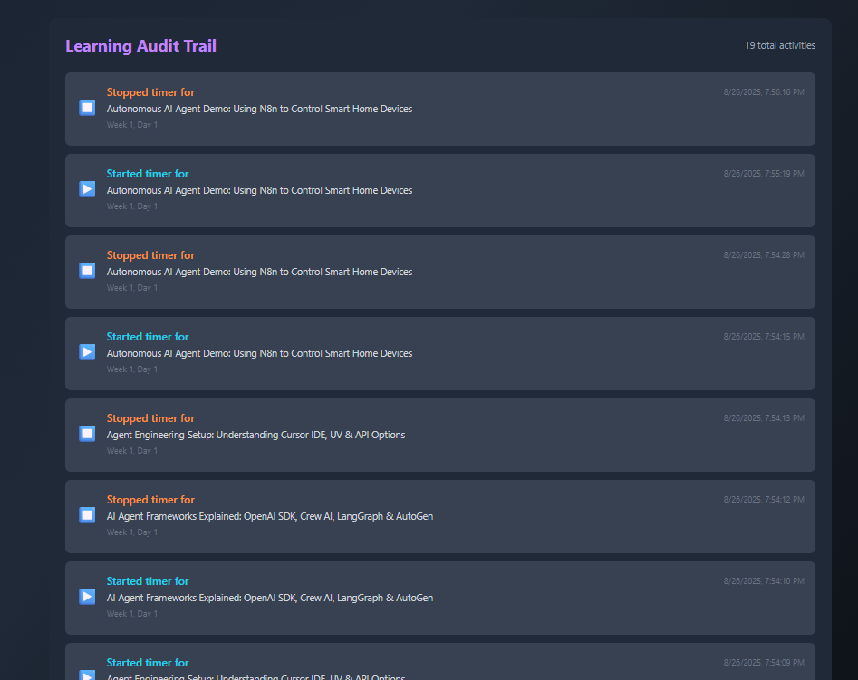
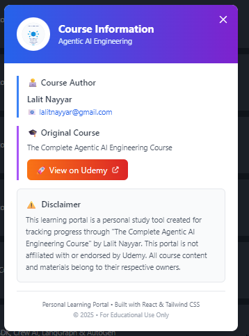

# Personal AI Learning Portal

A comprehensive React-based learning portal for tracking progress through "The Complete Agentic AI Engineering Course" by Lalit Nayyar.

> Quick Links: [User Guide](docs/USER_GUIDE.md) • [Administration Guide](docs/ADMIN_GUIDE.md)


## 📖 Table of Contents

- [Quick Start](#-quick-start)
- [User Guide](#-user-guide)
- [Features Overview](#-features-overview)
- [Administration Guide](#-administration-guide)
- [Technical Documentation](#-technical-documentation)
- [Screenshots](#-screenshots)
- [Support](#-support)
 - [Firebase Data Model & Event Flow](#-firebase-data-model--event-flow)

## 🚀 Quick Start

### Prerequisites
- Node.js (v14 or higher)
- npm or yarn package manager
- Modern web browser (Chrome, Firefox, Safari, Edge)

### Installation
```bash
# Clone the repository
git clone https://github.com/lalitnayyar/AIAgenticCourse.git

# Navigate to the project directory
cd AIAgenticCourse/learning-portal

# Install dependencies
npm install

# Start the development server
npm start

# Open your browser to http://localhost:3000
```

## 👤 User Guide

For the complete, step-by-step user documentation, see: [docs/USER_GUIDE.md](docs/USER_GUIDE.md)

### Getting Started
1. **First Launch**: Open the application in your browser
2. **Navigation**: Use the top navigation bar to switch between sections
3. **Data Persistence**: All your progress, notes, and settings are automatically saved locally

### Daily Workflow
1. **Check Dashboard**: Review your overall progress and select current week
2. **Use Planner**: Start timers for lessons you're working on
3. **Take Notes**: Add notes for each lesson or day
4. **Track Progress**: Monitor completion in the Progress section
5. **Review Schedule**: Check upcoming lessons and deadlines

### Key Features Usage

#### 🎯 Dashboard

- **Week Selector**: Click the dropdown to choose your current week (1-6)
- **Progress Cards**: View completion percentage, streak, and lesson counts
- **Time Metrics**: Monitor total time spent, expected duration, and efficiency
- **Quick Overview**: Get instant insights into your learning progress

#### 📅 Planner

- **Week Navigation**: Use arrow buttons to browse through weeks
- **Lesson Management**: Click checkboxes to mark lessons as complete
- **Timer Controls**: 
  - Click ▶️ to start timing a lesson
  - Click ⏹️ to stop the timer
  - View real-time timer display while recording
- **Progress Indicators**: Visual feedback for completed lessons

#### 📝 Notes

- **Week/Day Selection**: Choose specific week and day for notes
- **Add Notes**: Click "Add Note" to create new notes
- **Edit/Delete**: Use pencil and trash icons to modify notes
- **Notes Overview**: View all saved notes with quick navigation
- **Auto-Save**: Notes are automatically saved as you type

#### 📊 Progress

- **Weekly Bars**: Visual progress bars for each week
- **Daily Indicators**: Small circles showing daily completion status
- **Color Coding**: Different colors for each week for easy identification
- **Statistics**: Detailed completion metrics and percentages

#### 🗓️ Schedule

- **Calendar View**: Week and day-wise course layout
- **Start Date**: Modify course start date using the date picker
- **Duration Display**: View expected time for each day and week
- **Visual Indicators**: 
  - 🟢 Today's date
  - 🔵 Past days
  - ⚪ Future days
- **Schedule Summary**: Total course statistics

#### 📋 Audit Trail

- **Activity History**: Complete log of all actions
- **Event Types**: 
  - ✅ Lesson completions
  - ▶️ Timer starts
  - ⏹️ Timer stops
- **Timestamps**: Precise timing for all activities
- **Quick Reference**: Easy-to-scan activity overview

## 🔧 Features Overview

### Key Features
- Cross-device login with secure multi-session support (4 sessions for users, unlimited for admins)
- Cloud-first data synchronization with resilient local fallback
- Real-time lesson timers with protected progress tracking and audit logging
- Force refresh actions across UI for instant state updates
- Robust error handling and safe database operations
- Admin database reset tools with backups and strong safeguards

### Core Functionality

#### Time Tracking System
- **Individual Lesson Timers**: Start/stop timers for each lesson
- **Real-Time Display**: Live timer updates while recording
- **Automatic Accumulation**: Time automatically adds to lesson totals
- **Persistence**: All timing data saved locally
- **Audit Integration**: Timer events logged in audit trail

#### Progress Management
- **Completion Tracking**: Mark lessons as complete/incomplete
- **Visual Progress**: Progress bars and indicators throughout the app
- **Statistics**: Detailed metrics on completion rates and time spent
- **Streak Tracking**: Daily learning streak counter
- **Efficiency Metrics**: Compare expected vs actual time spent

#### Data Persistence
- **Local Storage**: All data saved in browser localStorage
- **Auto-Save**: Automatic saving of all changes
- **Data Recovery**: Data persists across browser sessions
- **Export Ready**: Data structure ready for future export features

#### User Interface
- **Dark Theme**: Professional dark theme throughout
- **Responsive Design**: Works on desktop, tablet, and mobile
- **Intuitive Navigation**: Clear navigation between sections
- **Visual Feedback**: Immediate feedback for all user actions
- **Accessibility**: Keyboard navigation and screen reader friendly

### Advanced Features

#### Schedule Management
- **Flexible Start Date**: Configurable course start date
- **Duration Calculations**: Automatic calculation of expected times
- **Calendar Integration**: Visual calendar with date indicators
- **Week Planning**: Plan and visualize entire course timeline

#### Notes System
- **Hierarchical Organization**: Notes organized by week and day
- **Rich Text Support**: Formatted text with line breaks
- **Search and Navigation**: Quick access to all notes
- **Bulk Operations**: Edit and delete multiple notes

#### Audit and Analytics
- **Complete Activity Log**: Every action tracked and timestamped
- **Performance Analytics**: Time efficiency and completion rates
- **Progress Trends**: Visual trends in learning progress
- **Data Insights**: Actionable insights from learning patterns

## 🔥 Firebase Database Reset Module

### ⚠️ **CRITICAL SAFETY WARNING**
**This module contains destructive operations that can permanently delete data. Use with extreme caution, especially in production environments.**

### Overview
The Firebase Database Reset Module provides comprehensive tools for managing and resetting the Firebase database with multiple interfaces and robust safety mechanisms.

### Components

#### 1. **Web Interface (`/reset` route)**
- **Access**: Admin users only
- **Features**: 
  - Visual database reset panel with safety warnings
  - Two reset types: User Data Only vs Complete Reset
  - Backup creation and restoration
  - Multiple confirmation checkboxes for destructive operations
  - Real-time status updates and error handling

#### 2. **Command Line Interface**
```bash
# Create database backup
npm run backup-db

# Reset user data only (preserves system settings)
npm run reset-users

# Complete database reset (DANGEROUS - destroys everything)
npm run reset-complete

# List available backups
npm run list-backups

# Direct script usage with options
node scripts/resetDatabase.js --user-data --force
node scripts/resetDatabase.js --restore backups/firebase_backup_2024-01-01.json
```

#### 3. **Core Reset Manager (`utils/firebaseReset.js`)**
- Backup creation with timestamp and collection data
- Collection-specific reset operations
- Production environment protection
- Automatic audit trail logging
- Safety checks and confirmations

### Reset Types

#### **User Data Reset**
- **Deletes**: Users, progress, notes, schedules
- **Preserves**: System settings, audit logs
- **Use Case**: Clean slate for users while keeping system configuration

#### **Complete Reset**
- **Deletes**: Everything in the database
- **Use Case**: Complete fresh start or development environment reset

### Safety Features

- **Multiple Confirmations**: Checkbox + text confirmations for destructive operations
- **Automatic Backups**: Created before any reset operation
- **Production Protection**: Enhanced safety checks for production environments
- **Environment Detection**: Automatic detection with appropriate warnings
- **Audit Trail**: All operations logged with timestamp and details

### Collections Managed

#### User Collections (Reset with `--user-data`)
- `portal_users` - User authentication data
- `user_progress` - Learning progress tracking
- `user_notes` - User-created notes
- `user_schedules` - User schedules and planning

#### System Collections (Reset only with `--complete`)
- `audit_logs` - System audit trail
- `settings` - Application settings and configuration

### Usage Examples

#### Web Interface
1. Login as admin user
2. Navigate to `/reset` in the portal
3. Follow the safety prompts and confirmations
4. Choose between user data reset or complete reset

#### Command Line
```bash
# Interactive reset with prompts
npm run reset-db

# Force reset without prompts (use carefully)
node scripts/resetDatabase.js --user-data --force

# Create backup before manual operations
npm run backup-db

# Restore from specific backup
node scripts/resetDatabase.js --restore backups/firebase_backup_2024-08-27.json
```

### Documentation
See `README_DATABASE_RESET.md` for comprehensive documentation including:
- Detailed safety procedures
- Backup and restore workflows
- Troubleshooting guide
- Best practices
- Security considerations

---

## 🛠️ Administration Guide

For detailed administration procedures, safety notes, and operations, see: [docs/ADMIN_GUIDE.md](docs/ADMIN_GUIDE.md)

### Initial Setup

#### System Requirements
- **Operating System**: Windows, macOS, or Linux
- **Node.js**: Version 14.0 or higher
- **Memory**: Minimum 4GB RAM recommended
- **Storage**: 500MB free space for installation
- **Browser**: Modern browser with JavaScript enabled

#### Installation Steps
1. **Download Source Code**:
   ```bash
   git clone https://github.com/lalitnayyar/AIAgenticCourse.git
   cd AIAgenticCourse/learning-portal
   ```

2. **Install Dependencies**:
   ```bash
   npm install
   # or using yarn
   yarn install
   ```

3. **Environment Configuration**:
   - No environment variables required for basic setup
   - All configuration stored in localStorage
   - Default settings work out of the box

4. **Start Application**:
   ```bash
   npm start
   # Application will open at http://localhost:3000
   ```

### Configuration Management

#### Course Structure Configuration
Edit `src/learning_plan.json` to modify:
- **Week Structure**: Add/remove weeks
- **Daily Lessons**: Modify lessons per day
- **Lesson Durations**: Update expected time for each lesson
- **Lesson Titles**: Customize lesson names and descriptions

```json
{
  "weeks": [
    {
      "week": 1,
      "title": "Week Title",
      "days": [
        {
          "day": 1,
          "lessons": [
            {
              "title": "Lesson Title",
              "duration": "15:30",
              "description": "Lesson description"
            }
          ]
        }
      ]
    }
  ]
}
```

#### Application Settings
Modify `src/App.js` for:
- **Navigation Structure**: Add/remove menu items
- **Theme Configuration**: Customize colors and styling
- **Component Layout**: Adjust page layouts

#### Styling Customization
Edit `src/App.css` and Tailwind classes for:
- **Color Schemes**: Modify theme colors
- **Typography**: Adjust fonts and sizes
- **Layout**: Change spacing and positioning
- **Animations**: Customize transitions and effects

### Data Management

#### Local Storage Structure
```javascript
// Progress tracking
completedLessons: Set of completed lesson IDs
timeTracking: Object with lesson timing data
auditTrail: Array of activity entries

// User preferences
selectedWeek: Currently selected week number
courseStartDate: Configurable start date
notes: Object with week/day organized notes
```

#### Data Backup
```javascript
// Export all data
const backupData = {
  completedLessons: Array.from(JSON.parse(localStorage.getItem('completedLessons') || '[]')),
  timeTracking: JSON.parse(localStorage.getItem('timeTracking') || '{}'),
  auditTrail: JSON.parse(localStorage.getItem('auditTrail') || '[]'),
  notes: JSON.parse(localStorage.getItem('notes') || '{}'),
  selectedWeek: localStorage.getItem('selectedWeek'),
  courseStartDate: localStorage.getItem('courseStartDate')
};
```

#### Data Recovery
```javascript
// Restore from backup
Object.keys(backupData).forEach(key => {
  if (key === 'completedLessons') {
    localStorage.setItem(key, JSON.stringify(backupData[key]));
  } else {
    localStorage.setItem(key, JSON.stringify(backupData[key]));
  }
});
```

### Maintenance Tasks

#### Regular Maintenance
- **Clear Old Data**: Periodically clean up old audit trail entries
- **Backup Data**: Export user data regularly
- **Update Dependencies**: Keep npm packages updated
- **Performance Monitoring**: Monitor localStorage usage

#### Troubleshooting

**Common Issues**:

1. **Application Won't Start**
   ```bash
   # Clear npm cache
   npm cache clean --force
   
   # Reinstall dependencies
   rm -rf node_modules package-lock.json
   npm install
   ```

2. **Data Not Persisting**
   - Check browser localStorage permissions
   - Verify localStorage quota not exceeded
   - Clear browser cache and reload

3. **Performance Issues**
   - Check localStorage size (limit ~10MB)
   - Clear old audit trail entries
   - Optimize large notes content

4. **Timer Not Working**
   - Check browser tab visibility API
   - Verify JavaScript execution not blocked
   - Clear timeTracking localStorage data

#### Development Mode
```bash
# Start with debugging
npm start

# Build for production
npm run build

# Test production build
npm install -g serve
serve -s build
```

### Security Considerations

#### Data Privacy
- **Local Storage Only**: No data sent to external servers
- **No Authentication**: No user accounts or passwords
- **Browser Isolation**: Data isolated per browser/device
- **No Network Requests**: Fully offline capable

#### Best Practices
- **Regular Backups**: Export data regularly
- **Browser Security**: Keep browser updated
- **Local Access**: Restrict physical access to device
- **Data Validation**: Input validation prevents data corruption

### Deployment Options

#### Local Deployment
- **Development**: `npm start` for local development
- **Production Build**: `npm run build` for optimized build
- **Static Hosting**: Deploy build folder to any static host

#### Web Hosting
- **GitHub Pages**: Deploy directly from repository
- **Netlify**: Automatic deployment from Git
- **Vercel**: Zero-configuration deployment
- **AWS S3**: Static website hosting

#### Enterprise Deployment
- **Internal Servers**: Deploy to company intranet
- **Docker**: Containerized deployment
- **Load Balancing**: Multiple instances for high availability
- **CDN**: Content delivery network for global access

## 📸 Screenshots

### Dashboard Overview

*Main dashboard showing progress metrics, week selection, and time tracking*

### Planner with Timer Controls

*Interactive lesson planner with real-time timer controls and progress tracking*

### Schedule Calendar View

*Week and day-wise course calendar with configurable start date and duration calculations*

### Notes Management

*Comprehensive notes system with week/day organization and CRUD operations*

### Progress Tracking

*Visual progress tracking with weekly bars and daily completion indicators*

### Audit Trail

*Complete activity history with timestamped entries and event categorization*

### Disclaimer Modal

*Course information modal with author details and Udemy course link*

## 🎯 Technical Stack

- **Frontend**: React 18 with React Router DOM
- **Styling**: Tailwind CSS with custom dark theme
- **State Management**: React Context API
- **Data Persistence**: Browser localStorage
- **Icons**: SVG icons and emoji
- **Responsive Design**: Mobile-friendly interface

## 🏗️ Course Structure

The portal follows the complete 6-week course structure:
- **Week 1**: Foundations of Agentic AI (5 days, 15 lessons)
- **Week 2**: Core Technologies & Frameworks (5 days, 15 lessons)
- **Week 3**: Advanced Implementation Techniques (5 days, 15 lessons)
- **Week 4**: Real-World Applications (5 days, 15 lessons)
- **Week 5**: Optimization & Scaling (5 days, 15 lessons)
- **Week 6**: Professional Deployment (5 days, 15 lessons)

## 💾 Data Persistence

All user data is stored locally in the browser:
- **Lesson Progress**: Completed lessons tracking
- **Time Tracking**: Individual lesson timers and total time spent
- **Notes**: All notes organized by week/day
- **Audit Trail**: Complete activity history
- **Settings**: Selected week, course start date, and preferences

## 🔄 Features in Detail

### Time Tracking System
- Individual lesson timers with start/stop controls
- Real-time timer display while recording
- Automatic time accumulation and persistence
- Integration with audit trail for complete activity logging

### Notes Management
- Week and day-based organization matching course structure
- Rich text editing capabilities
- Auto-save functionality with localStorage persistence
- Quick navigation between different notes

### Progress Monitoring
- Real-time progress calculations
- Visual progress bars for weeks and days
- Efficiency metrics comparing expected vs actual time
- Streak tracking for motivation

### Schedule Management
- Flexible course start date configuration
- Automatic calculation of expected durations
- Visual calendar with past/present/future indicators
- Comprehensive schedule summary

## 🤝 Support

For questions, suggestions, or issues:

### 📧 Contact Information
- **Author**: Lalit Nayyar
- **Email**: lalitnayyar@gmail.com
- **GitHub**: [AIAgenticCourse Repository](https://github.com/lalitnayyar/AIAgenticCourse)

### 🎓 Original Course
- **Course**: The Complete Agentic AI Engineering Course
- **Platform**: Udemy
- **Link**: [View Course with Coupon](https://www.udemy.com/course/the-complete-agentic-ai-engineering-course/?couponCode=MT260825G1)

### 🐛 Bug Reports
1. Check existing issues on GitHub
2. Create detailed bug report with:
   - Steps to reproduce
   - Expected vs actual behavior
   - Browser and OS information
   - Console error messages (if any)

### 💡 Feature Requests
1. Search existing feature requests
2. Create new request with:
   - Clear description of desired feature
   - Use case and benefits
   - Mockups or examples (if applicable)

## 📄 License

This project is for educational use only. All course content belongs to the original course creator.

### Disclaimer
This learning portal is a personal study tool created for tracking progress through "The Complete Agentic AI Engineering Course" by Lalit Nayyar. This portal is not affiliated with or endorsed by Udemy. All course content and materials belong to their respective owners.

---

*Built with ❤️ for effective learning and progress tracking*

**Personal Learning Portal • Built with React & Tailwind CSS**  
*© 2025 • For Educational Use Only*

## Installation & Setup

1. **Clone the repository**:
   ```bash
   git clone https://github.com/lalitnayyar/AIAgenticCourse.git
   cd AIAgenticCourse/learning-portal
   ```

2. **Install dependencies**:
   ```bash
   npm install
   ```

3. **Start development server**:
   ```bash
   npm start
   ```

4. **Open browser**: Navigate to `http://localhost:3000`

## Course Structure

The portal follows the complete 6-week course structure:
- **Week 1**: Foundations of Agentic AI (5 days, 15 lessons)
- **Week 2**: Core Technologies & Frameworks (5 days, 15 lessons)
- **Week 3**: Advanced Implementation Techniques (5 days, 15 lessons)
- **Week 4**: Real-World Applications (5 days, 15 lessons)
- **Week 5**: Optimization & Scaling (5 days, 15 lessons)
- **Week 6**: Professional Deployment (5 days, 15 lessons)

## Data Persistence

All user data is stored locally in the browser:
- **Lesson Progress**: Completed lessons tracking
- **Time Tracking**: Individual lesson timers and total time spent
- **Notes**: All notes organized by week/day
- **Audit Trail**: Complete activity history
- **Settings**: Selected week, course start date, and preferences

## Features in Detail

### Time Tracking System
- Individual lesson timers with start/stop controls
- Real-time timer display while recording
- Automatic time accumulation and persistence
- Integration with audit trail for complete activity logging

### Notes Management
- Week and day-based organization matching course structure
- Rich text editing capabilities
- Auto-save functionality with localStorage persistence
- Quick navigation between different notes

### Progress Monitoring
- Real-time progress calculations
- Visual progress bars for weeks and days
- Efficiency metrics comparing expected vs actual time
- Streak tracking for motivation

### Schedule Management
- Flexible course start date configuration
- Automatic calculation of expected durations
- Visual calendar with past/present/future indicators
- Comprehensive schedule summary

## Contributing

This is a personal learning tool. For suggestions or improvements, please contact:
- **Author**: Lalit Nayyar
- **Email**: lalitnayyar@gmail.com

## License

This project is for educational use only. All course content belongs to the original course creator.

## Original Course

**The Complete Agentic AI Engineering Course**
- **Instructor**: Lalit Nayyar
- **Platform**: Udemy
- **Link**: [View Course](https://www.udemy.com/course/the-complete-agentic-ai-engineering-course/?couponCode=MT260825G1)

---

*Built with ❤️ for effective learning and progress tracking*
